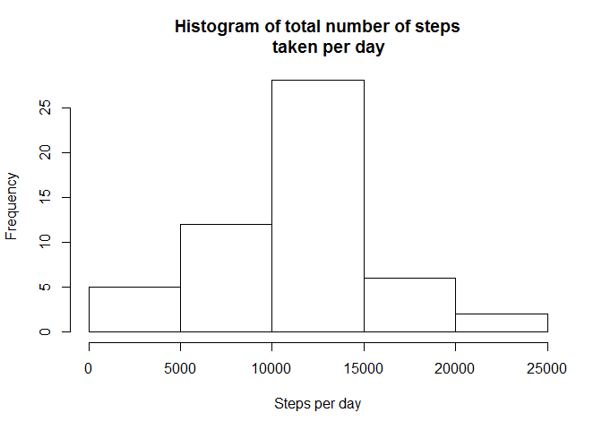
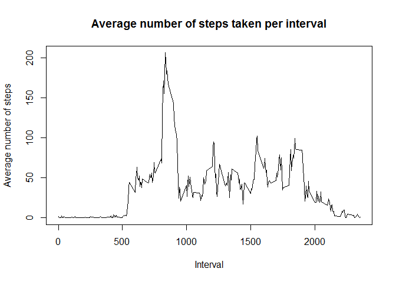
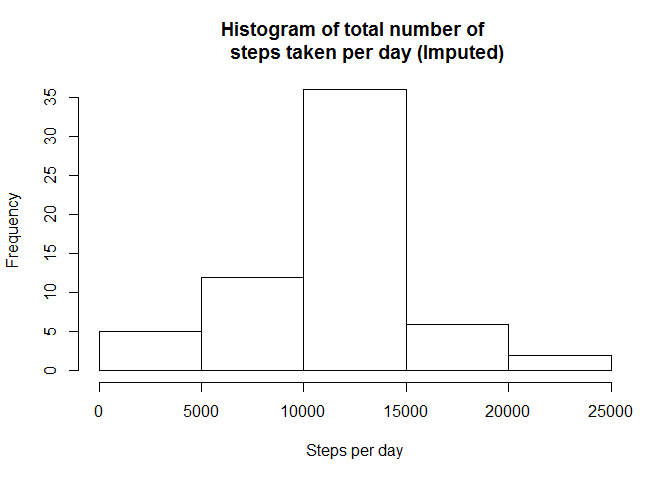
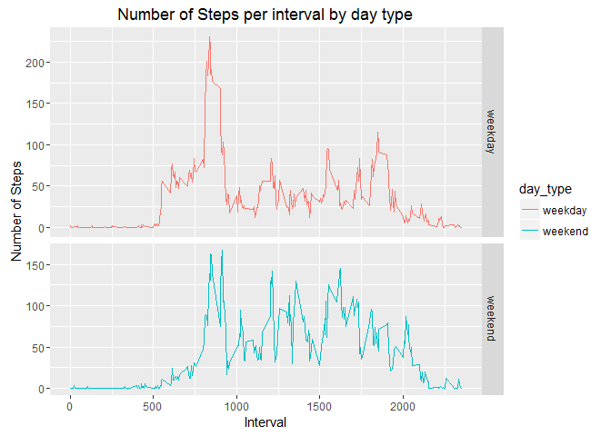

# Reproducible Research: Peer Assessment 1


```r
library(knitr)
```

```
## Warning: package 'knitr' was built under R version 3.2.4
```

```r
library(ggplot2)
# knit assumes the path of *.Rmd file as working directory. 
# Hence setting the root.dir to getwd() of R
opts_knit$set(root.dir=normalizePath('../')) 
# opts_chunk$set(fig.path = "figures/") 
```


### Loading and preprocessing the data

```r
# Check if data exists, if not create it. 
if(!file.exists("data")) {
    dir.create("./data")
}

# Unzip the activity file to /data directory. 
unzip("RepData_PeerAssessment1/activity.zip",exdir="./data")

# Read the activity file
activity <- read.csv("./data/activity.csv", header=TRUE)

# Exclude all the records which contain NA values. 
valid.activity <- activity[complete.cases(activity),]
```

### What is mean total number of steps taken per day?

```r
# calculate the total number of steps taken per day
steps.per.day <- aggregate(steps ~ date, data=valid.activity, sum)

# Draw the histogram on the total number of steps taken per day
hist(steps.per.day$steps,main="Histogram of total number of steps
     taken per day", xlab="Steps per day")
```




```r
# Calculate the mean of the total number of steps taken per day
print(paste("Mean of total number of steps taken per day", 
            round(mean(steps.per.day$steps),2)))
```

```
## [1] "Mean of total number of steps taken per day 10766.19"
```


```r
# Calculate the median of the total number of steps taken per day
print(paste("Median of total number of steps taken per day", 
            round(median(steps.per.day$steps),2)))
```

```
## [1] "Median of total number of steps taken per day 10765"
```

### What is the average daily activity pattern?

```r
# Calculate the average steps taken per interval for all days
avg.steps.per.interval <- aggregate(steps ~ interval, 
                                    data=valid.activity, mean)

# Plot the time series of the 5-minute interval and average steps 
# taken per interval
plot(avg.steps.per.interval$interval,avg.steps.per.interval$steps,type="l",
     ylab="Average number of steps",xlab = "Interval",
     main = "Average number of steps taken per interval")
```




```r
# Create a logical vector to identify the interval which 
# has the maximum steps
idx.max.steps <- avg.steps.per.interval$steps == 
                   max(avg.steps.per.interval$steps)

# Find the interval which has the maximum steps
max.avg.steps.per.interval <- avg.steps.per.interval[idx.max.steps,]

# Display the interval which has the maximum steps
print(paste("5-minute Interval which has the maximum steps is", 
            max.avg.steps.per.interval$interval, " and maximum steps is ",
            round(max.avg.steps.per.interval$steps,2)))
```

```
## [1] "5-minute Interval which has the maximum steps is 835  and maximum steps is  206.17"
```

### Imputing missing values
#### Adopted a strategy to replace NA values with average steps 
#### in 5-minute interval

```r
# Identify the NA records
missing.activity <- activity[!complete.cases(activity),]

# Display the total number NA rows.
print(paste("Number of rows with NAs ", 
            nrow(missing.activity)))
```

```
## [1] "Number of rows with NAs  2304"
```


```r
# calculate average steps per day - for my sake 
avg.steps.per.day <- aggregate(steps ~ date, data=valid.activity, mean)

# Fill the NA values with the average steps of the corresponding 
# 5-minute interval Create a new data frame activity_new using activity
# Loop through activity_new and look for NA's on the steps variable
# replace NA values with the average steps for the corresponding interval
activity_new <- activity
for (i in 1:nrow(activity_new)) {
        if(is.na(activity_new$steps[i])) {
                val <- avg.steps.per.interval$steps[which(
                        avg.steps.per.interval$interval 
                        == activity_new$interval[i])]
                activity_new$steps[i] <- val 
        }
}

# Calculate the total steps taken per day on the imputed data frame.
steps.per.day.imputed <- aggregate(steps ~ date, activity_new, sum)

# Draw the histogram on the total number of steps taken per day 
# using the imputed values
hist(steps.per.day.imputed$steps,main="Histogram of total number of 
     steps taken per day (Imputed)", xlab="Steps per day")
```




```r
# Display the mean of the total steps taken per day
print(paste("Mean of total number of steps taken per day using imputed values ",round(mean(steps.per.day.imputed$steps),2)))
```

```
## [1] "Mean of total number of steps taken per day using imputed values  10766.19"
```

```r
# Display the median of the total number of steps taken per day
print(paste("Median of total number of steps taken per day using imputed values ",round(median(steps.per.day.imputed$steps),2)))
```

```
## [1] "Median of total number of steps taken per day using imputed values  10766.19"
```

```r
# Mean stays the same.But Median has increased from 10765 to 10766.19 
# because of imputed values. 
```
### Are there differences in activity patterns between weekdays and weekends?

```r
# Identify the records corresponding to weekends
idx_weekends <- weekdays(as.Date(activity_new$date, '%Y-%m-%d')) %in% 
                c("Saturday","Sunday")

# Create a data frame only with weekend records
activity_weekends <- activity_new[idx_weekends,]

# Create a data frame only with weekdays records
activity_weekdays <- activity_new[!idx_weekends,]

# Create a factor variable day_type with levels weekday and weekend
activity_weekdays$day_type <- as.factor("weekday")
activity_weekends$day_type <- as.factor("weekend")

# Create a data frame combining weekday and weekend data frame
final_data <- rbind(activity_weekdays,activity_weekends)

# Calculate the average steps taken per interval across 
# weekends and weekdays
steps.per.day.imputed <- aggregate(steps ~ interval+day_type, 
                                   final_data, mean)

# Create a panel plot 
ggplot(steps.per.day.imputed, aes(interval,steps)) + 
        geom_line(stat = "identity", aes(color=day_type)) + 
        facet_grid(scales="free", space="free", day_type~.) + 
        labs(x="Interval",y="Number of Steps",
             title="Number of Steps per interval by day type") + theme_gray()
```



#### There are difference in activity patterns between weekdays and weekends. Seems
#### more steps are taken during weekdays morning hours. And same way more steps 
#### are taken during afternoon hours on weekends.
